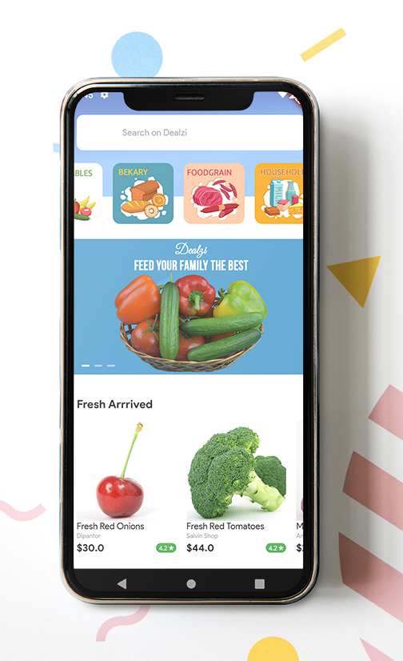
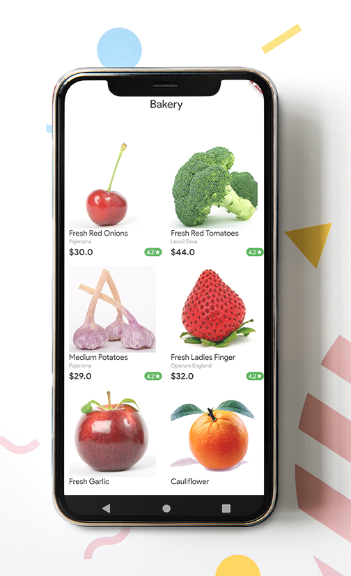
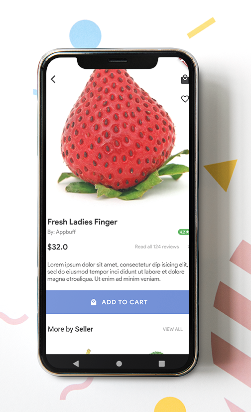
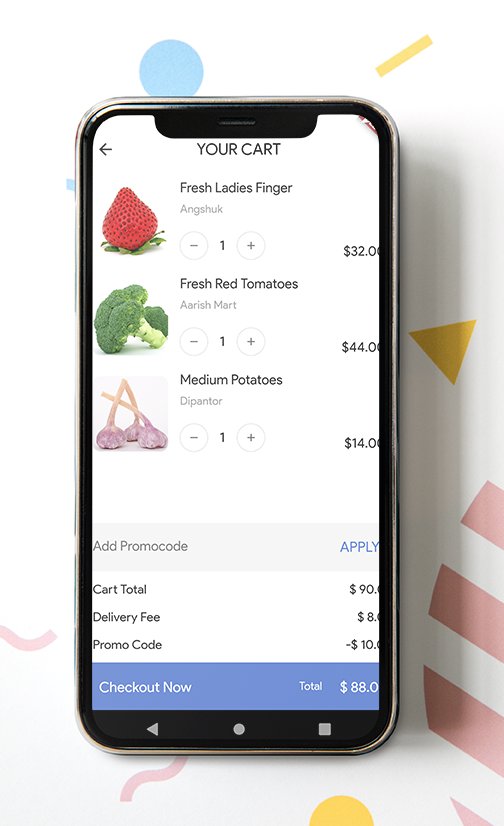
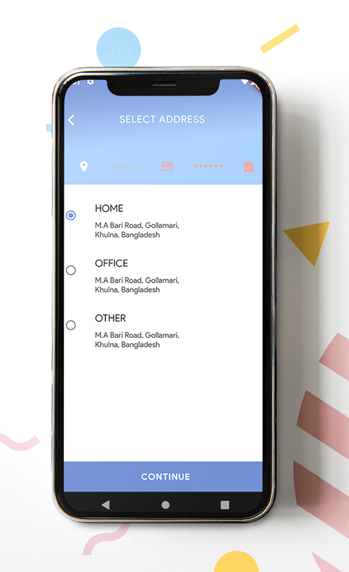
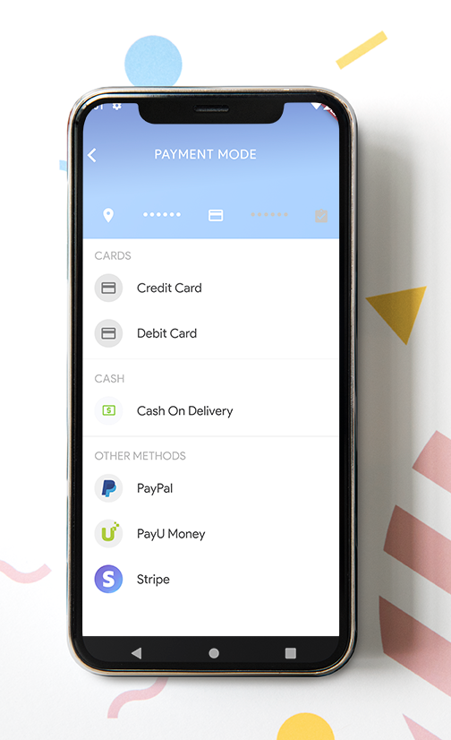
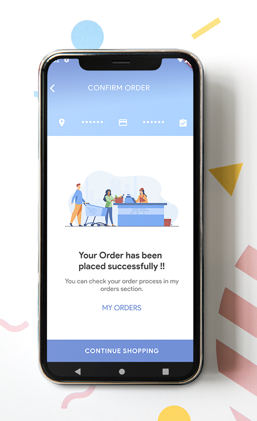

# DEALZI :strawberry:
Ready made Flutter Grocery Ecommerce App UI Kit.

Are you going to launch your online grocery shop or any Eeommerce mobile app then this Flutter Grocery App UI will help you to build the app in just a days, using Dealzi Flutter Grocery app UI, you only need to work on API integration, rest all has been added with love inside it.

The source code is **100% Dart**, and everything resides in the [/lib](https://github.com/shameemreza/dealzi/tree/master/lib) folder.

[](https://opensource.org/licenses/Apache-2.0)
[](https://github.com/shameemreza/dealzi/blob/master/licence.txt)

# 20+ Screens

- Home Screen
- Splash Screen
- Log in, Social login, Register and OTP Verification Screen
- Item Search
- Review Screen
- Seller Screen
- Cart Screen
- Address Screen
- Payment Screen
- Confirm Order Screen
- Menu Screen
- Profile Screen
- Offers Screen
- Add Address Screen
- Orders List Screen
- Add Review Screen
- Wishlist Screen
- About us Screen
- Contact us Screen
- Change Language Screen

# Screenshots


## License

```
Copyright 2020 Shameem Reza

Licensed under the Apache License, Version 2.0 (the "License");
you may not use this file except in compliance with the License.
You may obtain a copy of the License at

   http://www.apache.org/licenses/LICENSE-2.0

Unless required by applicable law or agreed to in writing, software
distributed under the License is distributed on an "AS IS" BASIS,
WITHOUT WARRANTIES OR CONDITIONS OF ANY KIND, either express or implied.
See the License for the specific language governing permissions and
limitations under the License.

## Getting Started

For help getting started with Flutter, view our online
[documentation](https://flutter.io/).
```
